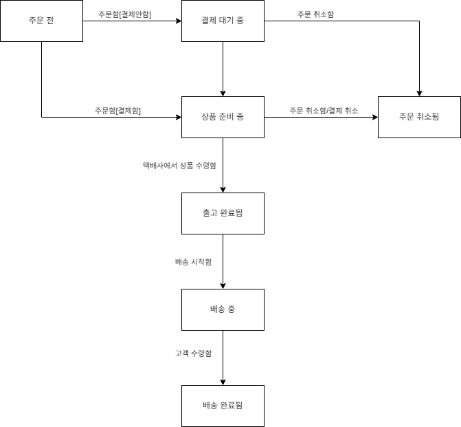

## 정리

도메인에 대해서는 많은 하위 도메인이 존재할 수 있고

도메인을 개념적으로 모델링 한 것이 개념모델이다.

개념모델은 단순히 객체모델 뿐만 아니라 상태 다이어그램으로도 표현이 가능하다.

주문 도메인을 예시로 그리자면 아래와 같다.



일반적인 애플리케이션의 아키텍쳐는 크게 4개의 영역으로 분리된다.

- `표현계층`: 사용자의 요청을 처리하고 사용자에게 정보를 보여다 준다. 여기서 사용자는 외부 시스템일 수 있다. 
- `응용`: 사용자가 요청한 기능을 실행한다. 직접 로직을 구현하진 않으며 도메인 계층을 조합하여 사용한다.
- `도메인`: 시스템이 제공할 도메인의 규칙을 정의한다.
- `인프라스트럭쳐`: 데이터베이스나 메시징 시스템과 같은 외부 시스템과의 연동을 처리한다.

위의 주문 상태다이어그램을 포함한 도메인 모델은 `개념모델`에 해당하며,

적절한 랭귀지를 사용해서 도메인 모델을 구현한 모델을 `구현모델`이라고 한다. 위의 4가지중 `도메인`에 해당한다.

중요한 차이로는 `개념모델` 상태에선 외부 서드파티 앱이나 의존성을 가지는 시스템과 성능 관련 이슈를 전혀 신경쓰지 않고 만들기 때문에

실제 코드를 작성할 때 `개념모델` 그대로를 사용하지 않고 `구현모델`로의 변화를 가진다.

처음부터 완벽한 `개념모델` 을 만드는 것은 불가능에 가깝다.

개발자와 도메인전문가의 의사소통간에 더욱 깊은 도메인 이해를 통해 변경되는 사항이 생겨날수밖에 없다.

따라서 윤곽을 이해할 수 있는 수준의 `개념모델`을 만들고 구현하는 과정에서 `구현모델`로의 점진적인 변화를 거쳐야한다.

예제코드: domainex1

---

## 도메인 모델 도출

도메인을 모델링할 때에는 관련한 규칙이 어떤것이 있는지 어떤 기능을 제공해야하는지를 요구사항으로부터 찾아야 한다.

다음은 주문 도메인에서의 관련된 요구사항이다.

- 최소 한 종류 이상의 상품을 주문해야 한다.
- 한 상품을 한 개 이상 주문할 수 있다.
- 총 주문 금액은 각 상품의 구매 가격 합을 모두 더한 금액이다.
- 각 상품의 구매 가격 합은 상품 가격에 구매 개수를 곱한 값이다.
- 주문할 때 배송지 정보를 반드시 지정해야 한다.
- 배송지 정보는 받는 사람 이름, 전화번호, 주소로 구성된다.
- 출고를 하면 배송지를 변경할 수 없다.
- 출고 전에 주문을 취소할 수 있다.
- 고객이 결제를 완료하기 전에는 상품을 준비하지 않는다.

> 나의 주문 도메인 해석

주문은 하나 이상의 상품을 가져야 하는데, 상품은 상품 자체의 가격이 있을 것이고

상품 가격의 합은 상품의 가격과 구매 개수를 곱한 값이어야 한다.

즉, 주문이라는 도메인 내에 상품을 뜻하는 것이 있고 이는 상품 정보인 상품의 가격을 포함하고 있을 것이다.

그러한 상품을 주문하는것은 주문항목으로서 주문할 상품과 개수 정보를 포함하고 있어야 한다.

'최소 한 종류 이상의 상품을 주문해야 한다.', '한 상품을 한 개 이상 주문할 수 있다.' 이 것이 의미하는것은 결국

주문항목은 상품이 반드시 있어야 하며, 그 개수는 0보다 커야 함을 의미한다.

또한 상품 가격의 합 계산은 결국 개수를 갖고 있는 주문항목이 가지고 있어야 한다.

그리고 주문항목이 반드시 주문내에 1개이상 있어야 한다.

배송지 정보를 포함하는 객체는 별도로 필요하다.

이전 다이어그램을 포함하여 생각해봤을 때 주문은 결제 기다림, 상품 준비중, 출고 완료됨, 배달 시작함, 배달 완료됨, 주문 취소됨의 상태를 가진다.

그 상태들 중에서 출고를 뜻하는 상태이전인 결제 기다림과 상품 준비중이라면 배송지 변경이 가능하고 주문 취소도 가능해야 한다.

즉, 주문 도메인을 구현할 때 협력할 객체들은 총 아래와 같이 정리되었다.

`Order: 주문`, `OrderLine: 주문 항목`, `Product: 상품`, `ShippingInfo: 배송지 정보`

그리고 각각의 기능을 생각해봤을 때,

`OrderLine`은 `Order`가 총 가격을 계산하기 위해서 상품 가격의 합을 제공해야 한다.

`Product`는 `OrderLine`이 가격을 계산하기 위해서 상품의 가격을 제공해야 한다.

`Order`는 결제 대기중에서 결제가 완료되었다는 메세지를 받아서 처리해야 하고, 

상품 준비중에서 출고가능해졌단 메세지를 받으면 출고 상태로 변경할수 있어야 하고,

주문 취소에 대한 메세지를 받으면 취소상태로 변경할 수 있어야 하고

배송지 변경에 대한 메세지를 받을 수 있는 기능이 있어야 한다.

또한 협력할 객체들의 관계를 생각해보면

`OrderLine`은 하나의 `Product`를 반드시 가져야 한다. 

`Order`는 하나이상의 `OrderLine`을 반드시 가져야 한다. 하나 이상이기 때문에 `List<OrderLine>` 형태가 된다.

> 책과 함께 이해했던 주문 도메인 해석

### 협력관계의 객체들을 도출했다면, 그들의 상태와 메세지를 정의하자

처음에 객체들을 도출하고 객체의 상태와 상태에 대한 검증(verify) 그리고 메세지를 함께 고려하다보니 머리가 많이 복잡했다.

객체의 필수 상태들을 고민하고, 필수 상태에 대한 생성자를 만들자.

그리고 메세지를 받을 메소드들을 만든 다음, 협력하여 소통하도록 구성하고나서 '최소 한 종류 이상의 상품을 주문해야 한다.' 와 같은 도메인 규칙을 구현하자.

### 객체들의 생명주기를 고려해보자.

우선 협력관계의 객체를 도출하는 것에서 서로의 생명주기가 동일하게 유지되는 객체들이 있다.

`Order`과 `OrderLine`의 관계를 보자면, `OrderLine`은 반드시 `Order`없이는 생길 수 없다.

또한 `OrderLine` 과 `Product` 관계를 보자면, 이 둘도 서로 밀접하게 이뤄진다.

이러한 강한 의존성을 가지는 객체들의 생명주기가 실제 도메인 모델에서도 같은지를 평가하고

진짜로 같다면 반드시 생성될 수 있도록 생성자를 만들어 주어야 한다.

즉, `Order` 가 `OrderLine` 없는체로 생성되는일은 막아야 한단 것이다.

```java
public class Order {
	
	private List<OrderLine> orderLines;
	
	public Order(List<OrderLine> orderLines) {
		setOrderLines(orderLines);
    }
    //...
}
```

또한 `List<OrderLine>` 을 받았다면 '총 주문 금액은 각 상품의 구매 가격 합을 모두 더한 금액이다.' 을 계산할 수 있어야 한다.

나의 코드에서는 생성자에서 총 주문금액에 해당하는 필드인 `int totalAmount`를 전혀 계산하고 있지 않았다.

만약에 주문항목에 대한 가격의 변동점이 있다면... 라는 생각에 잠겨있었다.

계산을 도와주는 private한 메소드를 만들어서 totalAmount를 계산해주면 된다.

위의 만약에를 생각한다면 해당 private한 메소드를 호출하면 그만이다.

```java
public class Order {

	private List<OrderLine> orderLines;
	private int totalAmounts;

	public Order(List<OrderLine> orderLines) {
		setOrderLines(orderLines);
	}
	//...

	public void setOrderLines(List<OrderLine> orderLines) {
		verifyAtLeastOneOrMoreOrderLines(orderLines);
		this.orderLines = orderLines;
		calculateTotalAmounts();
	}
	
	private void calculateTotalAmounts() {
		int sum = orderLines.stream()
            .mapToInt(x -> x.getAmounts())
            .sum();
		this.totalAmounts = sum;
    }
}
```
---

## 엔티티와 값

엔티티는 식별자가 존재하는것이 가장 큰 특징이다.

해당 식별자를 통해 서로 동일한지 비교를 한다.

예를들어 주문 도메인에서 `Order`는 주문번호라고 하는 `orderNo` 를 식별자로 가질 것이다.

동일의 비교를 Java에서는 `hashCode()` 와 `equals()` 메소드의 오버라이딩으로 구현할 수 있다.

엔티티에서 내부상태를 변경하는 메소드를 `public`으로 기능으로서 제공할 때, `setter`관례를 따르지않고 어떤 변화를 주는지 명확하게 명시해야 한다.

값의 경우 하나의 값으로 평가되어지는 요소들을 모은 객체라고 볼 수 있다.

예를들어 주문 도메인에서 `ShippingInfo` 같은 경우는 어떤 식별자로 구분되는 것이 아닐것이다.

같은 광역시내에 서로다른 도시이기만 해도 서로 다르다고 평가 될것이다.

이처럼 값 객체는 내부 필드의 값이 모두 같다고 평가된다면 같은 객체로 평가된다.

값 객체는 `불변성`을 띄는것이 좋다. 만약 값을 바꿔야 한다면 새로운 값 객체로 생성하여 반환해야 한다.

값 객체는 원시타입끼리 다중 의미를 갖는경우 별도의 값 객체로 바꾸는것을 고려해야 한다.

예를들어 `int quantity`는 양을 나타내는 `int`라고 하면, `int totalAmounts`는 상품의 총 가격을 나타낸다.

즉, 하나는 수량을 나타내고 있고 다른 하나는 돈의 금액을 나타내고 있다.

하나의 원시타입이 하나의 객체모델 속에서 여러 의미를 가지지 않도록 `Money totalAmounts`를 제공하는것이 좋다.


